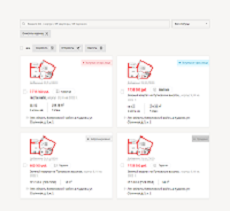
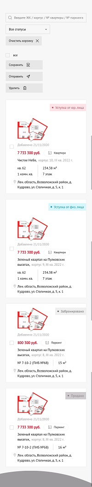

# spbrealty

## Project setup
```
npm install
```

### Compiles and hot-reloads for development
```
npm run serve
```

### Compiles and minifies for production
```
npm run build
```

### Lints and fixes files
```
npm run lint
```

### Customize configuration
See [Configuration Reference](https://cli.vuejs.org/config/).

### Дополнительно
```
От себя добавила адаптацию для мобильных устройств:
 - в адаптиве есть свои шероховатости, в особенности разные отступы от картинок сверху при сжатии карточки
```


```
активны для нажатия:
 - чекбоксы и статусы
 - есть работающий фильтр по продуктам
 - тултипы работают при наведении
бизнес логика
 - поиск по ключевому слову сделан для примера
 - всю логику вынесла в pages/List.vue
 - vuex не стала подключать, так как задание тестовое
```
